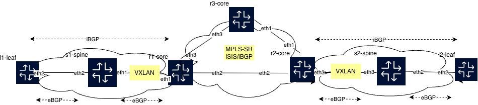

# VXLAN and MPLS-SR transparent Gateway
Gateway between VXLAN DC and MPLS-SR Core, only with IPv6 for both the link peering and the EVPN overlay peering.
NOTE: Both IPv4 and IPv6 carried over the same EVPN peering which is a smooth alternative to 6PE/Dualstack solutions since with EVPN the BGP NEXT_HOP careless if its either IPv4 or IPv6. 


## Network Topology




## EVPN Gateway keypoints

The Routers Node Segment is created as part of node-segment index knob and the labelrange allocated for the protocol, here ISIS. NOTE EOS default allocated range for both ISIS-SR and BGP-SR 900000.  

```bash
r2-core#sh mpls label ranges
Start     End       Size      Usage
------------------------------------------------
0         15        16        reserved
16        99999     99984     static mpls
100000    116383    16384     bgp (dynamic)
116384    132767    16384     bgp (dynamic)
132768    149151    16384     isis (dynamic)
149152    362143    212992    free (dynamic)
362144    899999    537856    unassigned
900000    965535    65536     ospf-sr
900000    965535    65536     isis-sr
900000    965535    65536     bgp-sr
965536    1031071   65536     srlb
1031072   1032095   1024      l2evpn shared ethernet-segment
1032096   1036287   4192      unassigned
1036288   1048575   12288     l2evpn

r2-core#sh run interfaces Loopback0
interface Loopback0
   ip address 112.112.112.112/32
   ipv6 address 2001:112:112:112::112/128
   node-segment ipv4 index 12
   node-segment ipv6 index 612
   isis enable igp
   isis metric 0
   isis passive

r2-core#sh mpls segment-routing bindings
2001:111:111:111::111/128
   Local binding:  Label: 900611
   Remote binding: Peer ID: r3-core, Label: 900611
2001:112:112:112::112/128
   Local binding:  Label: imp-null
   Remote binding: Peer ID: r3-core, Label: 900612
2001:113:113:113::113/128
   Local binding:  Label: 900613
   Remote binding: Peer ID: r3-core, Label: imp-null

```

To allow time-exceeded message and thereby make traceroute useful for the MPLS core, below code snippet needed on the MPLS Core Routers

```bash
r2-core#sh run sec icmp
mpls icmp ttl-exceeded tunneling
mpls icmp ipv6 source-interface Loopback0
mpls icmp ip source-interface Loopback0

```


The Gateway snippet below shows the MPLS vs VXLAN association for the BGP peer groups, this is the Gateway configuration

```bash
r2-core#sh run sec address-family evpn
router bgp 65550
   address-family evpn
      neighbor 65001v6 activate
      neighbor 65001v6 encapsulation vxlan
      neighbor 65550v6 activate
      neighbor 65550v6 encapsulation mpls next-hop-self source-interface Loopback0
      neighbor default next-hop-self received-evpn-routes route-type ip-prefix

```

Below show the FIB on the Gateway for the EVPN IPv6 and IPv4 routes

```bash
r2-core#sh ipv6 route vrf evpn_1
VRF: evpn_1
Displaying 4 of 8 IPv6 routing table entries
Source Codes:
       C - connected, S - static, K - kernel, O3 - OSPFv3,
       O3 IA - OSPFv3 inter area, O3 E1 - OSPFv3 external type 1,
       O3 E2 - OSPFv3 external type 2,
       O3 N1 - OSPFv3 NSSA external type 1
       O3 N2 - OSPFv3 NSSA external type2, B - Other BGP Routes,
       A B - BGP Aggregate, R - RIP,
       I L1 - IS-IS level 1, I L2 - IS-IS level 2, DH - DHCP,
       NG - Nexthop Group Static Route, M - Martian,
       DP - Dynamic Policy Route, L - VRF Leaked,
       G  - gRIBI, RC - Route Cache Route,
       CL - CBF Leaked Route

 B I      2001:123:123:123::123/128 [200/0]
           via 2001:111:111:111::111/128, IS-IS SR tunnel index 1, label 100001
              via fe80::a8c1:abff:fef9:b10a, Ethernet1, label 900611
 B I      2001:132:132:132::132/128 [200/0]
           via VTEP 2001:112:112:112::12 VNI 10 router-mac 00:1c:73:11:0b:01 local-interface Vxlan1
 B I      2001:666::/64 [200/0]
           via 2001:111:111:111::111/128, IS-IS SR tunnel index 1, label 100001
              via fe80::a8c1:abff:fef9:b10a, Ethernet1, label 900611
 C        2001:777::/64 [0/0]
           via Loopback1, directly connected

```
```bash
r2-core#sh ip route vrf evpn_1
VRF: evpn_1
Source Codes:
       C - connected, S - static, K - kernel,
       O - OSPF, O IA - OSPF inter area, O E1 - OSPF external type 1,
       O E2 - OSPF external type 2, O N1 - OSPF NSSA external type 1,
       O N2 - OSPF NSSA external type2, O3 - OSPFv3,
       O3 IA - OSPFv3 inter area, O3 E1 - OSPFv3 external type 1,
       O3 E2 - OSPFv3 external type 2,
       O3 N1 - OSPFv3 NSSA external type 1,
       O3 N2 - OSPFv3 NSSA external type2, B - Other BGP Routes,
       B I - iBGP, B E - eBGP, R - RIP, I L1 - IS-IS level 1,
       I L2 - IS-IS level 2, A B - BGP Aggregate,
       A O - OSPF Summary, NG - Nexthop Group Static Route,
       V - VXLAN Control Service, M - Martian,
       DH - DHCP client installed default route,
       DP - Dynamic Policy Route, L - VRF Leaked,
       G  - gRIBI, RC - Route Cache Route,
       CL - CBF Leaked Route

Gateway of last resort is not set

 B I      6.6.6.6/32 [200/0]
           via 2001:111:111:111::111/128, IS-IS SR tunnel index 1, label 100000
              via fe80::a8c1:abff:fef9:b10a, Ethernet1, label 900611
 C        7.7.7.7/32 [0/0]
           via Loopback1, directly connected
 B I      123.123.123.123/32 [200/0]
           via 2001:111:111:111::111/128, IS-IS SR tunnel index 1, label 100000
              via fe80::a8c1:abff:fef9:b10a, Ethernet1, label 900611
 B I      132.132.132.132/32 [200/0]
           via VTEP 2001:112:112:112::12 VNI 10 router-mac 00:1c:73:11:0b:01 local-interface Vxlan1

```


Below traceroute validation of end-to-end IPv6 and IPv4 from the EVPN VRF evpn_1.
NOTE: The direct link between r1-core and r2-core are disabled to force labeling forwarding over r3-core router, else penultimate rule would apply thereby no labeling forwarding.  

```bash
l2-leaf#sh bgp evpn route-type ip-prefix 2001:123:123:123::123/128
BGP routing table information for VRF default
Router identifier 112.112.112.12, local AS number 64523
BGP routing table entry for ip-prefix 2001:123:123:123::123/128, Route Distinguisher: 111.111.111.11:10
 Paths: 1 available
  Local
    2001:112:112:112::112 from 2001:112:112:112::112 (112.112.112.112)
      Origin IGP, metric -, localpref 100, weight 0, tag 0, valid, internal, best
      Originator: 111.111.111.11, Cluster list: 112.112.112.112 111.111.111.111
      Extended Community: Route-Target-AS:65000:10 TunnelEncap:tunnelTypeVxlan EvpnRouterMac:00:1c:73:7d:1e:ff
      Rx path id: 0x1
      VNI: 10
l2-leaf#

l2-leaf#sh ipv6 ro vrf evpn_1 2001:123:123:123::123/128
VRF: evpn_1
Routing entry for 2001:123:123:123::123/128
Source Codes:
       C - connected, S - static, K - kernel, O3 - OSPFv3,
       O3 IA - OSPFv3 inter area, O3 E1 - OSPFv3 external type 1,
       O3 E2 - OSPFv3 external type 2,
       O3 N1 - OSPFv3 NSSA external type 1
       O3 N2 - OSPFv3 NSSA external type2, B - Other BGP Routes,
       A B - BGP Aggregate, R - RIP,
       I L1 - IS-IS level 1, I L2 - IS-IS level 2, DH - DHCP,
       NG - Nexthop Group Static Route, M - Martian,
       DP - Dynamic Policy Route, L - VRF Leaked,
       G  - gRIBI, RC - Route Cache Route,
       CL - CBF Leaked Route

 B I      2001:123:123:123::123/128 [200/0]
           via VTEP 2001:112:112:112::112 VNI 10 router-mac 00:1c:73:7d:1e:ff local-interface Vxlan1

l2-leaf#traceroute vrf evpn_1 ipv6 2001:123:123:123::123
traceroute to 2001:123:123:123::123 (2001:123:123:123::123), 30 hops max, 80 byte packets
 1  2001:112:112:112::112 (2001:112:112:112::112)  5.064 ms  5.440 ms  6.230 ms
 2  2001:113:113:113::113 (2001:113:113:113::113) <MPLS:L=900611,E=0,S=0,T=1/L=100001,E=0,S=1,T=1>  7.790 ms  9.858 ms  10.326 ms
 3  2001:111:111:111::111 (2001:111:111:111::111) <MPLS:L=100001,E=0,S=1,T=1>  12.934 ms  14.269 ms  14.981 ms
 4  2001:111:111:111::11 (2001:111:111:111::11)  15.318 ms  15.876 ms  16.104 ms
l2-leaf#

```
```bash
l2-leaf#sh bgp evpn route-type ip-prefix 123.123.123.123/32
BGP routing table information for VRF default
Router identifier 112.112.112.12, local AS number 64523
BGP routing table entry for ip-prefix 123.123.123.123/32, Route Distinguisher: 111.111.111.11:10
 Paths: 1 available
  Local
    2001:112:112:112::112 from 2001:112:112:112::112 (112.112.112.112)
      Origin IGP, metric -, localpref 100, weight 0, tag 0, valid, internal, best
      Originator: 111.111.111.11, Cluster list: 112.112.112.112 111.111.111.111
      Extended Community: Route-Target-AS:65000:10 TunnelEncap:tunnelTypeVxlan EvpnRouterMac:00:1c:73:7d:1e:ff
      Rx path id: 0x1
      VNI: 10
l2-leaf#

l2-leaf#sh ip ro vrf evpn_1 123.123.123.123/32
VRF: evpn_1
Source Codes:
       C - connected, S - static, K - kernel,
       O - OSPF, O IA - OSPF inter area, O E1 - OSPF external type 1,
       O E2 - OSPF external type 2, O N1 - OSPF NSSA external type 1,
       O N2 - OSPF NSSA external type2, O3 - OSPFv3,
       O3 IA - OSPFv3 inter area, O3 E1 - OSPFv3 external type 1,
       O3 E2 - OSPFv3 external type 2,
       O3 N1 - OSPFv3 NSSA external type 1,
       O3 N2 - OSPFv3 NSSA external type2, B - Other BGP Routes,
       B I - iBGP, B E - eBGP, R - RIP, I L1 - IS-IS level 1,
       I L2 - IS-IS level 2, A B - BGP Aggregate,
       A O - OSPF Summary, NG - Nexthop Group Static Route,
       V - VXLAN Control Service, M - Martian,
       DH - DHCP client installed default route,
       DP - Dynamic Policy Route, L - VRF Leaked,
       G  - gRIBI, RC - Route Cache Route,
       CL - CBF Leaked Route

 B I      123.123.123.123/32 [200/0]
           via VTEP 2001:112:112:112::112 VNI 10 router-mac 00:1c:73:7d:1e:ff local-interface Vxlan1

l2-leaf#traceroute vrf evpn_1 ip 123.123.123.123
traceroute to 123.123.123.123 (123.123.123.123), 30 hops max, 60 byte packets
 1  113.113.113.113 (113.113.113.113) <MPLS:L=900611,E=0,S=0,T=1/L=100000,E=0,S=1,T=1>  11.754 ms  12.036 ms  12.496 ms
 2  111.111.111.111 (111.111.111.111) <MPLS:L=100000,E=0,S=1,T=1>  14.736 ms  15.091 ms  18.928 ms
 3  123.123.123.123 (123.123.123.123)  19.437 ms  21.414 ms  21.835 ms
l2-leaf#

```

To scale the setup, both spine and core router in each DC have listen ranges to allow easier provisioning of Leafs for both eBGP underlay and eBGP overlay sessions

```bash
r2-core#sh run sec 65001
router bgp 65550
   bgp listen range 2001:112:112:112::/64 peer-group 65001v6 remote-as 65001
   neighbor 65001v6 peer group
   neighbor 65001v6 remote-as 65001
   neighbor 65001v6 local-as 65001 no-prepend replace-as
   neighbor 65001v6 update-source Loopback0
   neighbor 65001v6 route-reflector-client
   neighbor 65001v6 additional-paths send any
   neighbor 65001v6 send-community extended
   neighbor 65001v6 maximum-routes 0
   address-family evpn
      neighbor 65001v6 activate
      neighbor 65001v6 encapsulation vxlan
   vrf evpn_1
      route-target import evpn 65001:10
      route-target export evpn 65001:10

r2-core#sh bgp sum | grep 2001:112:112:112::12
2001:112:112:112::12        65001 Established   L2VPN EVPN              Negotiated              2          2          6

```

```bash
s2-spine#sh run sec range
peer-filter fabric-2byte
   10 match as-range 64512-65535 result accept
peer-filter fabric-4byte
   10 match as-range 1-4294967295 result accept
router bgp 64522
   bgp listen range 2001:3:3:3::/64 peer-group fabricv6 peer-filter fabric-2byte


s2-spine#sh bgp sum
BGP summary information for VRF default
Router identifier 112.112.112.22, local AS number 64522
Neighbor               AS Session State AFI/SAFI                AFI/SAFI State   NLRI Rcd   NLRI Acc   NLRI Adv
------------- ----------- ------------- ----------------------- -------------- ---------- ---------- ----------
2001:3:3:3::2       65550 Established   IPv6 Unicast            Negotiated             11         11          5
2001:3:3:3::5       64523 Established   IPv6 Unicast            Negotiated              2          2         11

```


## Setup environment
Setup was created using containerlab, to install it:

```bash
bash -c "$(curl -sL https://get.containerlab.dev)"

```

Ensure Docker is installed and running on your system.
For the cEOS image use the EOS downloader alt if you already have the image import it into docker directly

```bash
$ docker import cEOS-lab-$EOS_VERSION.tar ceos:$EOS_VERSION

```

The Topology based on the basic.clab.yml yaml file

```bash
[yaml file](basic.clab.yml)

```

## Containerlab commands
Containerlab is used to deploy and manage the network topology for this project. 

To start and stop the lab
```bash
containerlab deploy -t topology.clab.yaml
containerlab destroy -t topology.clab.yaml

```
